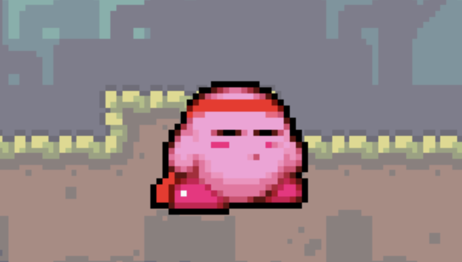
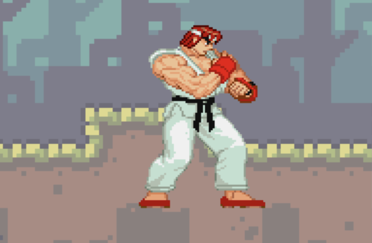
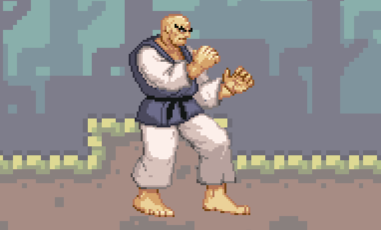
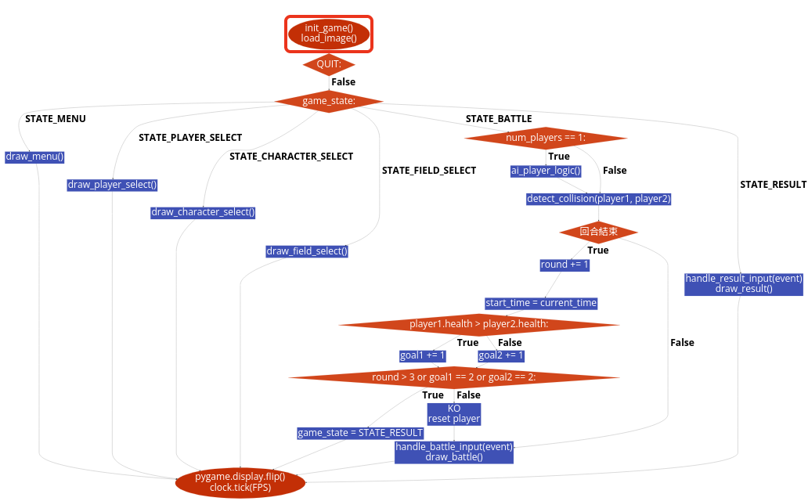
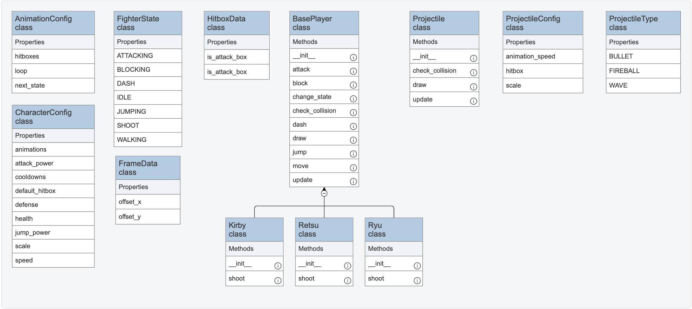

# 2024aoop_final_project

## Installation

1.安裝所需函式庫

```cmd
pip3 install -r requirements.txt -v
```

2.執行game_flow.py

```cmd
python3 game_flow.py
```

## Game Rules

**遊戲介紹：**

這是一款快節奏的2D格鬥遊戲，玩家可以選擇角色展開刺激對戰。遊戲提供單人模式（與AI對戰）和雙人模式（與朋友對戰），滿足不同玩家的挑戰需求。  

在戰鬥中，玩家可靈活運用普通攻擊、技能攻擊和防禦，預判敵人的行動，爭取在時限內擊敗對手。遊戲採三戰兩勝制，得分的方式只有兩種：在回合結束時擁有更多血量，或者——**直接KO你的對手！**  

無論你是新手還是高手，都能在這款遊戲中找到樂趣。快來體驗熱血沸騰的格鬥世界吧！

**遊戲流程：**

1. **選擇模式**  
   玩家可選擇單人模式（與AI對戰）或雙人模式（與朋友對戰）。  

2. **選擇角色**  
   從角色列表中挑選一名角色，準備進入戰鬥。  

3. **選擇場地**  
   玩家可以從多個場地中挑選心儀的戰鬥場景，增添對戰樂趣。  

4. **開始對戰**  
   - 每場比賽採三戰兩勝制。  
   - 玩家使用普通攻擊、技能攻擊或防禦應對對手，爭取在時限內佔據優勢。  

5. **計算勝負**  
   每回合結束時，血量較多的一方得分；若對手被KO，則直接獲勝。  

6. **結束遊戲**  
   當一方率先贏得兩回合，遊戲結束，顯示比賽結果。  

## Characters

### Kirby



| **Features** | Runs faster, jumps higher, and has greater agility.                                              |
|--------------|--------------------------------------------------------------------------------------------------|
| **Skill**    | Launches a fast-moving fireball that deals significant damage to enemies it hits. (Cooldown: 3s) |

### Ryu



| **Features** | Capable of dealing massive damage but has low health, making it easy to be defeated.                                                                      |
|--------------|-----------------------------------------------------------------------------------------------------------------------------------------------------------|
| **Skill**    | Fires an energy projectile that deals massive damage.  Pressing the skill button again will teleport the user to the projectile's location.(Cooldown: 5s) |

### Retsu



| **Features** | Possesses excellent attack damage and health but can only perform melee attacks.                                   |
|--------------|--------------------------------------------------------------------------------------------------------------------|
| **Skill**    | Dashes quickly in the current direction, stopping upon hitting an enemy and dealing damage to them. (Cooldown: 6s) |

## Game Controls

### Single Player

| **A** | walk left  |
|-------|------------|
| **D** | walk right |
| **W** | jump       |
| **S** | defend     |
| **C** | attack     |
| **V** | dash       |
| **B** | skill      |

### Double Player

**Player1**

| **A** | walk left  |
|-------|------------|
| **D** | walk right |
| **W** | jump       |
| **S** | defend     |
| **C** | attack     |
| **V** | dash       |
| **B** | skill      |

**Player2**

| **LEFP**  | walk left  |
|-----------|------------|
| **RIGHT** | walk right |
| **UP**    | jump       |
| **DOWN**  | defend     |
| **:**     | attack     |
| **L**     | dash       |
| **K**     | skill      |

## Code Architecture

### Flowchart



### Class Diagram


